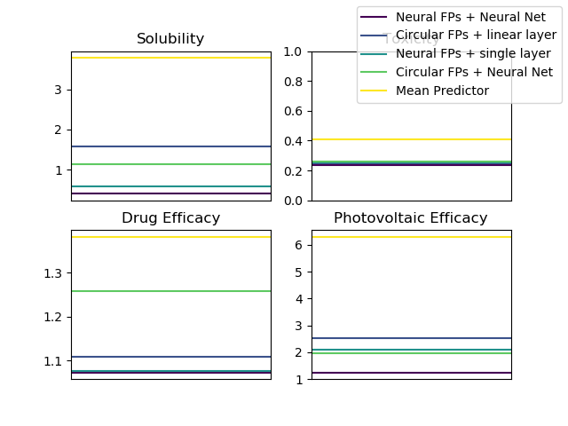

# Project submission for "392109: Machine Learning for Networks, Structures and Graphs"
by Paul Stahlhofen

This project was an application of a software called Neural Fingerprint, written by David Duvenaud, Dougal Maclaurin et al. The original code can be found at [https://github.com/HIPS/neural-fingerprint](https://github.com/HIPS/neural-fingerprint). For the purpose, idea and implementation of neural fingerprints, please read the original paper, stored as `neural_fingerprints.pdf` in this directory.

## Goals of the Project
The first and most significant goal was to get the neural fingerprint package to work properly. In particular, it should be used to carry out a hyperparameter search on different data sets. The derived best hyperparameters could than be used for further experiments. My original plan was to test whether a model with weights that were trained on one dataset could be used for feature prediction with the exact same weights on a different dataset. This transfer learning capability is interesting because the neural fingerprint algorithm - in contrast to the circular fingerprint it is built on - produces fingerprints that depend on the task at hand. It turned out during the project, however, that the hyperparameter search consumed a lot of time. The main reason for this was, that I had to use a cluster for the parameter searching process and that there were thousands of jobs to be run in order to produce a reliable result. For this reason, I am only presenting the performance results and those hyperparameters that were found to yield these best results in this submission. On this foundation, experiments regarding transfer learning may be conducted in future research.

## Files included in this submission
- `all_losses.csv`: records of the best test loss across all hyperparameter trials for each dataset and model
- `best_hyperparameters.zip`: archive containing the best hyperparameters for each dataset and model in terms of a `params_string` i.e. a Python-dictionary printed to a file. This format is used, because it is accepted by `eval_methods.py`
- `compare_hyperparameters.py`: The Python script producing `hyperparameters.csv`
- `eval_methods.py`: The Python script doing the actual hyperparameter evaluation by training a model and checking it's performance. It takes as input a `params_string` provided via `STDIN` and writes a json-file to `STDOUT`
- `hyperparameters.csv`: Best hyperparameters for the neural fingerprint model across all datasets
- `launch_experiments.py`: The main Python script, setting up parameter bounds and other preparations for the hyperparameter search. In the original code, this had to be provided with a second script as a command-line argument. I changed `launch_experiments.py` to my own needs in order to produce the parameter-files stored in `tmp` and the `params_and_outs.txt`.
- `mlgraphs.yml`: The environment's yml-file for use with anaconda (see section **How to use the program**)
- `neural_fingerprints.pdf`: The original paper forming the basis of this project. You may check it out for comparisons or for references to the datasets being used.
- `nfpexperiment`: A folder with helper scripts provided by the authors
- `parameter_table.pdf`: A table showing some of the best hyperparameters for the neural fingerprint model
- `params_and_outs.txt`: This is an auxiliary file used to split the hyperparameter search in single jobs of one large Slurm-array
- `performance_table.pdf`: A table comparing the authors' results of the hyperparameter search with my own.
- `run_hyperparameter_search.sh`: This contains directives for Slurm
- `sbatchfile.sh`: This starts the Slurm process as defined in `run_hyperparameter_search.sh`
- `slurm_results.zip`: This contains all the results obtained from hyperparameter-trials and thereby represents the main outcome of this project. Note: unzipping this creates a directory with 10000 files
- `test_losses.png`: Visualization of the best test losses obtained for each model and dataset
- `tmp`: folder containing all `param_strings` for the hyperparameter search, stored in files
- `visualize_loss.py`: The Python script producing `test_losses.png`

## Results
In a first step, I plotted test losses of all models on all datasets to compare them qualitatively. In each case, I picked the best run out of all hyperparameter trials and train-test folds for the corresponding dataset. As you can see in Figure 1, my results resemble the ones obtained by the authors: The neural fingerprint model performs equally good or better than all of the other models for each of the datasets.

|  |
|:--:|
| Figure 1: Visualization of the performance results obtained from a hyperparameter search for all models on all datasets.  |

To better compare my results to the original ones, I reconstructed the performance table shown in the paper and inserted my own losses in there (see Table 1 below). The general trend when comparing the models to each other is the same for both experiments. It appears, however, that the results obtained from my own hyperparameter trials achieve slightly lower test error throughout all models and datasets. As a reason for this, I assume that the authors did not pick the best value throughout all hyperparameter trials and data folds, but instead used a range of values to produce a confidence interval for each measurement.
The missing entries in the table reflect that they were no performance results for the toxicity dataset reported in the original paper. Nonetheless, they neural fingerprint model has a slight performance edge over all the other models also in this case.

|  |
|:--:|
| Table 1: Comparing results from the authors to my own hyperparameter search. The upper number in each cell represents the authors' results while the lower one represents mine. |

In a final step, I investigated the hyperparameters that led to best performance of the Neural Fingerprint model for each dataset. Results are shown in table 2 below. Most of the parameter settings differ widely across the datasets. In particular, very small (1) as well as very large (4) fingerprint depths produced good results for different use cases. The only trend that seems to hold for all tasks is that a small step size (close to 10<sup>-8</sup>) yields better results than a larger one.

|  |
|:--:|
| Table 2: Some hyperparameters found to lead to best performance for the Neural Fingerprint model. The table gives the (Low)er and (Up)per limit for each parameter, as well as results for the (S)olubility, (T)oxicity, (D)rug Efficacy and (P)hotovoltaic Efficacy dataset. |

## How to use the program

The folder submitted here replaces the directory `experiment_scripts` in the original project. Hence, the first steps are:

Clone the original project from GitHub

```git clone https://github.com/HIPS/neural-fingerprint```

Replace the `experiment_scripts` folder by the project submission

```
cd neural-fingerprint
rm -rf experiment_scripts
mv /path/to/project_submission .
```

As a next step, you should install the older Python version and the packages that are required to run the code. For this purpose, I recommend the use of Anaconda. To make the installation easier, I constructed a file containing all the necessary information to create a new conda environment called `mlgraphs`

```
cd project_submission
conda env create -f mlgraphs.yml
```

Note: I cannot guarantee that the automatic environment creation will work without problems on all operating systems. If you get an error because certain package versions could not be found, I recommend to set up a new environment with python 2.7

```conda env create -n mlgraphs python=2.7```

and installing the package dependencies as they are described in the neural-fingerprint `README.md` manually afterwards.
If you only wish to inspect the results using scripts, you have fulfilled all requirements at this point. You may unzip the archive `slurm_results.zip` (note again that it contains 10000 files) and inspect best test-losses, loss evolution and hyperparameter choices. As helpers you may use scripts from the `nfpexperiment` folder. In particular, `util.get_jobs_data`, turning a list of filenames into a list of result-dictionaries is useful here.  
In case you want to re-run the hyperparameter search itself, you need to have the Slurm workload manager installed on your system. Please see the [Documentation](https://slurm.schedmd.com/documentation.html) for information on how to use and install Slurm. I used the [TechFak GPU cluster](https://www.techfak.net/gpu-cluster) for the hyperparameter search. For all five models and four datasets, 50 trials were carried out for each of 5 different data folds (i.e. train-test splits of the dataset). Hence, 5000 jobs had to be run in total. Slurm job-arrays are designed to handle large amounts of similar tasks wihtout blocking too many cores on a shared system. However, there is an upper limit of how many jobs can be stored in one array. For the TechFak GPU cluster, this limit is 1000. For this reason, I splitted the jobs in 5 portions of 1000 each and wrote a slurm script (`run_hyperparameter_search.sh`) to pass the processing parameters to the workload manager. Before you can start it, two things need to be prepared:

1. You have to make the file `eval_methods.py` executable on your system. Please run `chmod u+x eval_methods.py` and change the first line of the file, replacing the path with the location on your machine.

2. You have to create an empty results folder. This can be achieved via

`mkdir results`

After these preparations you can start the Slurm array by executing `sbatchfile.sh`. This will read parameter files and output-file names from `params_and_outs.txt` and pass the result to `run_hyperparameter_search.sh` which will initialize the first 1000 runs. While the first jobs are started, you may realize that new files called `slurm-<ARRAY_ID>_<JOB_ID>.out` appear in your working directory. These are logging files that containt what was printed to `STDOUT` by each of the jobs. You may copy all of them to the `results` folder in the end using grep

```mv $(ls | grep 'slurm-<ARRAY_ID>*') results```

where `<ARRAY_ID>` is replaced by the identifier of the slurm-array, printed when starting the job. After the first 1000 jobs are finished (which may take several days), I found that an easy way to continue is to remove the first 1000 lines from `params_and_outs.txt` and execute the `sbatchfile.sh` again. If you really want to go through the whole process, I recommend creating a backup copy of `params_and_outs.txt`, so you don't accidentally loose information.
